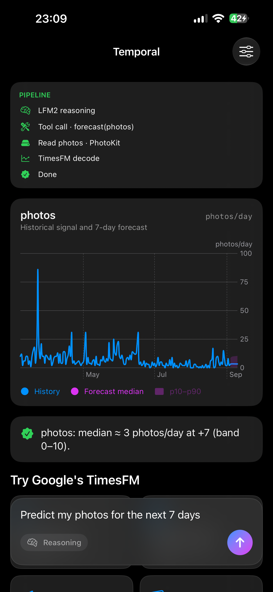
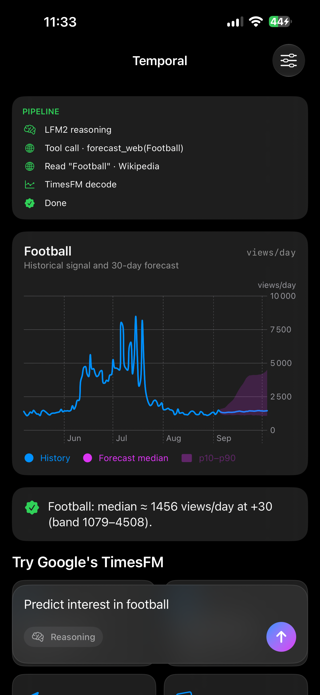

# Temporal — an on-device forecasting agent (LFM2 orchestrates TimesFM)

A native **SwiftUI iOS app** where a small language model **orchestrates a time-series
foundation model as a tool**, entirely on the iPhone via Apple's **MLX**. You ask in
plain language; the LLM decides what to forecast, pulls the data, and hands it to the
forecaster — then answers with a chart. **No server, no API for the models.**

- **LFM2.5-2.6B** (LiquidAI) — the tool-calling orchestrator, via `mlx-swift-lm`.
- **TimesFM-3** (Google Research) — the zero-shot forecaster, via a **native Swift/MLX
  port I wrote**: [`TimesFM-3-MLX-Swift`](https://github.com/Hemeskyo/TimesFM-3-MLX-Swift)
  (parity ~1e-6 vs PyTorch; loaded in `bfloat16` on-device to halve memory).

```
prompt → LFM2 (routing / tool call) → data provider → TimesFM (decode) → chart
```

> The payoff of a **learning-in-public** journey:
> [transformer from scratch](https://github.com/Hemeskyo/miniGPT) →
> [QLoRA fine-tune LFM2 for tool-calling](https://github.com/Hemeskyo/lfm-qlora) →
> [merge + convert + quantize to MLX](https://github.com/Hemeskyo/lfm-mlx) →
> [port TimesFM-3 to Swift/MLX](https://github.com/Hemeskyo/TimesFM-3-MLX-Swift) →
> **run both, hand in hand, in a real iOS app** (this repo).

---

## What it does

**Forecasting** is the headline. Ask for a prediction and the LLM routes it to the right
tool + data source, then TimesFM forecasts the series (median + p10–p90 band):

| You say | Data source | On-device? |
|---|---|---|
| "Predict my steps for the next 7 days" | Apple Health (steps) | ✅ private, local |
| "Predict my active energy / distance / photos" | Apple Health · Photos | ✅ private, local |
| "Predict public interest in Artificial Intelligence" | Wikipedia pageviews | inference local, data from the web |

The same agent still performs **real actions** when a request maps to one — reminders,
calendar events, Maps directions, timers, messages (EventKit / MapKit / …) — or just
**answers in chat** for anything else.

A live **PIPELINE** panel makes the orchestration visible as it runs
(`LFM2 reasoning → tool call → read source → TimesFM decode → done`), alongside a
telemetry panel (prefill/decode tok/s + a rolling memory graph).

---

## How it works

```
user text
   ▼
LFM2  (mlx-swift-lm, tool-calling)
   ├─ forecast(metric)      → HealthKit / Photos → series ─┐
   ├─ forecast_web(topic)   → Wikipedia pageviews → series ─┤→ TimesFM (Swift/MLX port) → chart
   ├─ create_reminder / …   → real Apple API                │
   └─ (no tool)             → chat answer                    │
                                                    median + p10–p90 band
```

- **Routing.** One system prompt + a tool registry; the LLM emits a typed `ToolCall`
  (`toolCallFormat: .lfm2`), and a `dispatch` router runs the matching handler.
- **Forecast tools.** `forecast` reads an on-device metric (HealthKit / Photos);
  `forecast_web` resolves a subject to a canonical Wikipedia article and pulls its daily
  pageviews. Both feed the same `TimesFM3Forecaster.predict`.
- **The forecaster.** My Swift/MLX port of TimesFM-3, loaded in `bfloat16`
  (`ModelConfig(precision: .bfloat16)`) — ~650 MB resident instead of ~1.3 GB.
- **Two-model memory budget.** Onboarding downloads both models once; later launches
  show a "Warming up models" splash and load from cache. MLX's GPU cache is cleared
  after each run to stay under the jetsam ceiling.

Measured on an **iPhone 15 Plus (6 GB)**: ~**120 tok/s prefill**, ~**28 tok/s decode**,
a forecast in a few seconds, both models resident.

---

## Models

- **[`Hskyto/lfm2.5-2.6b-toolcall-mlx-q4`](https://huggingface.co/Hskyto/lfm2.5-2.6b-toolcall-mlx-q4)**
  — LiquidAI **LFM2.5-2.6B**, 4-bit MLX, QLoRA-tuned for tool-calling on
  [`Salesforce/xlam-function-calling-60k`](https://github.com/Hemeskyo/lfm-qlora).
- **TimesFM-3** (Google Research), 330M — run through
  [`TimesFM-3-MLX-Swift`](https://github.com/Hemeskyo/TimesFM-3-MLX-Swift), a from-scratch
  Swift/MLX port (multivariate targets, covariates, arbitrary context; validated to ~1e-6).

Weights download from Hugging Face on first launch and are cached on-device.

---

## Honest limits

- **Forecasting needs structure.** TimesFM works on series with memory — trend,
  seasonality, autocorrelation. It captures the *trend* of Wikipedia interest, not the
  unpredictable **viral spikes** (attention is largely exogenous), and it cannot predict
  genuinely random processes (lotteries, markets).
- **On-device vs web.** All model inference is local. Health/Photos forecasts are fully
  on-device and private; the Wikipedia forecast fetches public data over the network.
- **bf16 trade-off.** The default `float32` port keeps ~1e-6 parity; this app opts into
  `bfloat16` for memory, at ~1% deviation — negligible against a forecast's own p10–p90
  band, and the price of running two models on a phone without crashing.

---

## Screenshots

<p align="center">
  
  &nbsp;&nbsp;
  
</p>
<p align="center">
  <sub><b>Left</b> — predicting public interest in a subject from Wikipedia pageviews &nbsp;·&nbsp; <b>Right</b> — forecasting on-device personal data (Apple Health / Photos), 100% local</sub>
</p>

<p align="center">
  
  &nbsp;&nbsp;
  
  &nbsp;&nbsp;
  
</p>
<p align="center">
  <sub>The same agent also drives real Apple actions and general chat, with live on-device telemetry.</sub>
</p>

---

## Project structure

```
mlx_ios_toolcallApp.swift    # @main entry point
Inference/
  ModelManager.swift         # LFM2: load, streaming generation, tool/chat routing, metrics, memory
  Metrics.swift              # one run's performance numbers
Forecasting/
  TimesFMManager.swift       # forecast orchestration + pipeline trace; routes metric/web
  TimesFMEngine.swift        # calls the TimesFMMLX Swift port (bf16), builds the quantile band
  ForecastModels.swift       # TimeSeriesPoint / ForecastPoint / ForecastResult
  HealthDataProvider.swift   # HealthKit: daily steps / active energy / distance
  PhotoDataProvider.swift    # PhotoKit: daily photo counts
  WikipediaDataProvider.swift# resolves a subject → article, fetches daily pageviews
  DemoForecastEngine.swift   # synthetic series (previews / fallback)
Tools/
  Tools.swift                # tool schemas + dispatch router (forecast, forecast_web, actions)
  AppleEvents.swift          # EventKit: reminders + calendar
  DeviceActions.swift        # Maps, timers, Messages
Views/
  OnboardingView.swift       # mandatory first-run: download both models
  ContentView.swift          # chat, suggestion cards, pipeline trace, forecast chart, telemetry
  ForecastView.swift         # history + median + p10–p90 band chart
  PerformancePanel.swift     # speed bars + live memory sparkline
  SettingsView.swift         # sampling params + memory controls
Support/
  DeviceSpecs.swift          # device RAM + jetsam headroom → recommended cache size
```

---

## Running it

Needs **Xcode** and a **real Apple-silicon iPhone** (MLX does not run on the Simulator;
Health data also only exists on a device).

1. Open the project in Xcode.
2. Swift Package Manager pulls **`mlx-swift-lm`**, **`swift-transformers`**, and
   **`TimesFM-3-MLX-Swift`** (the forecaster).
3. In the target's **Signing & Capabilities**, add **HealthKit**; in **Info**, add the
   usage strings for **Health**, **Photo Library**, **Reminders**, and **Calendars**.
4. Run on a device. First launch downloads both models once (~2 GB total), then caches
   them; later launches load from cache.
5. Tap a suggestion card, or ask for a forecast.

---

## License

App code: **MIT**. Model weights are distributed by their respective authors
(LiquidAI, Google) under their own licenses and are not included here.
