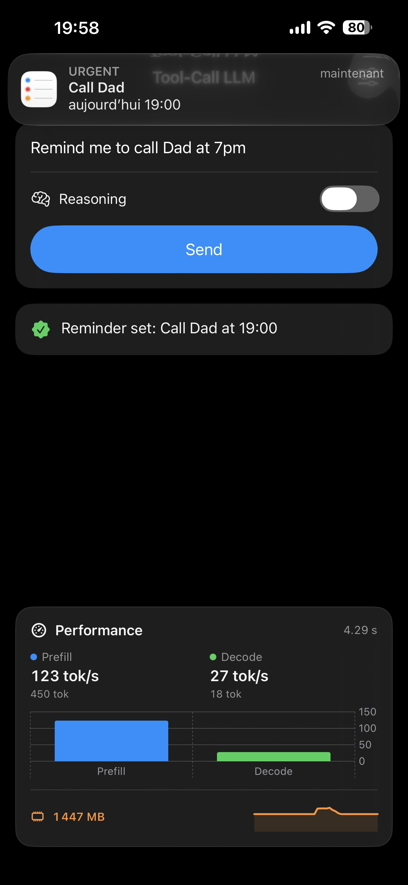
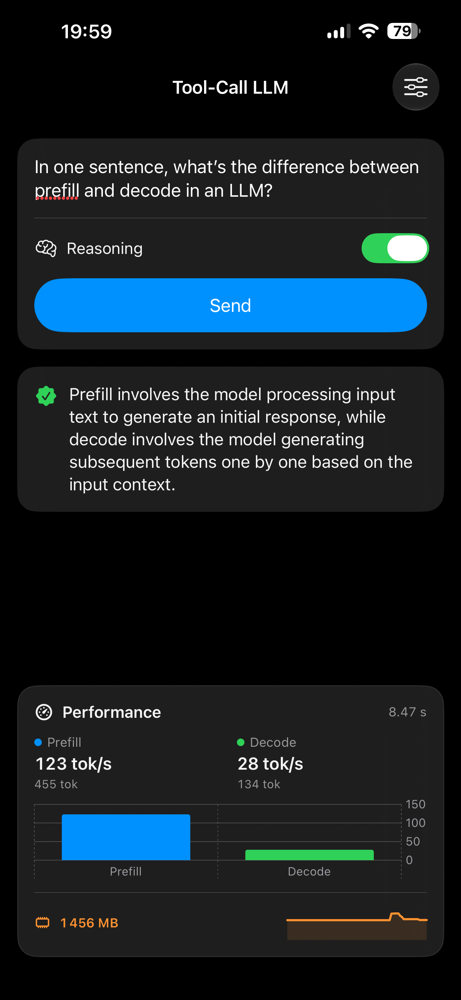
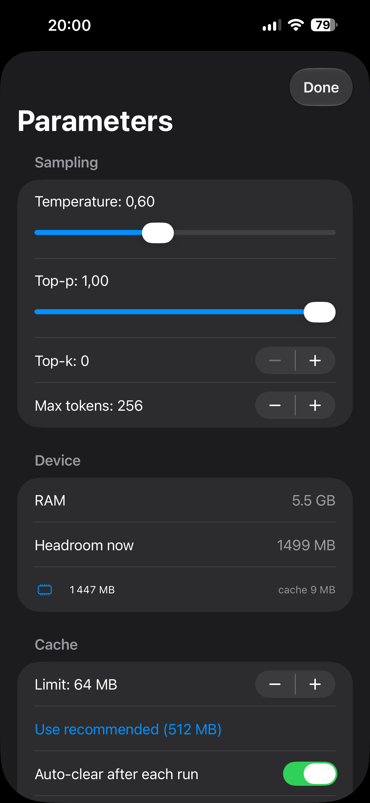

# mlx-ios-toolcall — a fine-tuned LLM calling real Apple APIs, fully on-device

A native **SwiftUI iOS app** that runs a QLoRA-tuned **LFM2.5-2.6B** tool-calling model **entirely on the iPhone** via Apple's **MLX**, and turns its tool calls into **real actions** — reminders, calendar events, Maps directions, timers, messages.

> The payoff of a four-part **learning-in-public** journey: [build a transformer from scratch](https://github.com/Hemeskyo/miniGPT) → [QLoRA fine-tune LFM2.5 for tool-calling](https://github.com/Hemeskyo/lfm-qlora) → [merge + convert + quantize to MLX](https://github.com/Hemeskyo/lfm-mlx) → **run it in a real iOS app** (this repo).

---

## The goal

Two things, in order:

1. **Hands-on mastery** — learn on-device ML deployment by *building* it, block by block: model loading, streaming generation, tool calling, quantization trade-offs, memory management, and performance measurement.
2. **Ship an open-source app** — grow this into a general iOS app that can **import any Hugging Face MLX model** (by repo id) and **benchmark + chat** with it, entirely on-device. The tool-calling assistant here is the first vertical slice; the model loader, streaming pipeline, live metrics, and sampling controls are the reusable foundation for a "bring your own model" app.

**Roadmap toward that:** arbitrary HF model import · general chat mode · benchmark mode (tok/s + memory across models) · on-device model management (download / delete) · the tool-vs-chat dual behavior.

---

## What it does

Type a request. The model runs on-device and either **calls a tool** (and the app executes it against a real Apple framework) or **answers directly** in chat.

| You say | What happens |
|---|---|
| "Remind me to call Dad at 7pm" | Creates a real **Reminder** at 19:00 (EventKit) |
| "Schedule a dentist appointment at 10am for 60 min" | Adds a real **Calendar** event (EventKit) |
| "Give me directions to the airport" | Opens **Apple Maps** with the route |
| "Set a timer for 15 minutes" | Schedules a **local notification** alarm |
| "Text Sarah I'll be late" | Opens **Messages** prefilled |
| "What is 18 × 36?" | Just **answers** — no tool |

It also shows a **live telemetry panel** — prefill/decode tok/s, token counts, and a **rolling memory graph** — plus a Settings sheet with sampling controls and **device-aware memory management** (cache limit, auto-clear, and a recommended size based on the device's actual headroom).

---

## Screenshots

<p align="center">
  
  &nbsp;&nbsp;
  
  &nbsp;&nbsp;
  
</p>

<p align="center">
  <sub><b>Left</b> — "call Dad at 7pm" → a real Reminder at 19:00, ~4s on-device &nbsp;·&nbsp; <b>Center</b> — general chat with live prefill/decode metrics &nbsp;·&nbsp; <b>Right</b> — sampling params + device-aware memory controls</sub>
</p>

---

## Why this is the interesting part

Training a model is one thing; making it *usable on a phone* is another. This app is where the on-device constraints get real:

- **Memory.** The 16-bit and 8-bit builds OOM-crash on a 6 GB iPhone (jetsam). This ships the **4-bit** build (~1.5 GB) and actively manages MLX's GPU buffer cache to stay alive across prompts.
- **Latency.** Decode is the slow phase (one token at a time). The app adds a **reasoning toggle** that skips LFM2's chain-of-thought for faster tool calls.
- **Reliability.** Skipping reasoning sometimes makes the model *chat* instead of *act* — so the app **falls back to a reasoning pass** when the fast pass doesn't produce a tool call.

---

## The model

- **[`Hskyto/lfm2.5-2.6b-toolcall-mlx-q4`](https://huggingface.co/Hskyto/lfm2.5-2.6b-toolcall-mlx-q4)** — 4-bit MLX, ~1.5 GB, downloaded on first launch and cached on-device.
- Base: **LiquidAI/LFM2.5-2.6B** (hybrid conv + attention — small KV-cache, ideal for on-device).
- Fine-tuned with a **QLoRA adapter** on **Salesforce/xlam-function-calling-60k** ([training repo](https://github.com/Hemeskyo/lfm-qlora)).
- Emits tool calls in LFM2's Pythonic format, parsed for free by `mlx-swift-lm`'s `toolCallFormat: .lfm2`.

---

## How it works

```
user text
   │  UserInput(chat: [.system(prompt), .user(text)], tools: schemas,
   │            additionalContext: ["enable_thinking": …])
   ▼
mlx-swift-lm  →  chat template (+ tools injected)  →  MLX generate (streaming)
   │
   ├─ .toolCall  → dispatch(name, args)  → real Apple API (EventKit / MapKit / …)
   ├─ .chunk     → conversational text (chat answer)
   └─ .info      → GenerateCompletionInfo → live perf metrics
```

| Concept | What it does | Why it matters |
|---|---|---|
| **`mlx-swift-lm` + MLX** | Runs the LFM2 model on the Apple GPU, in unified memory | No server, no CUDA — the model runs *on the phone* |
| **`toolCallFormat: .lfm2`** | Library parses `<|tool_call_start|>[…]` into a typed `ToolCall` | Tool-call parsing for free — the scary part, solved |
| **Tool registry + `dispatch`** | One list of tool schemas + a name→handler router | Adding a tool = one schema + one `case` |
| **`enable_thinking` toggle** | Custom chat-template guard skips the `<think>` block | Fewer decode tokens → faster (my main speed lever) |
| **Try-fast, fall back** | No-think first; retry with reasoning if no tool fired | Speed on easy prompts, reliability on hard ones |
| **`Reply { .tool / .chat }`** | Model either acts or answers; a system prompt routes it | One assistant that does tools *and* chat |
| **MLX memory controls** | Cache limit + auto-clear + manual "clear now", exposed in Settings | Tunable defense against jetsam OOM (staircase → sawtooth) |
| **Live memory monitor** | 2 Hz sampler → rolling MB sparkline in the home panel | Watch memory breathe during generation, in real time |
| **Device-aware recommendation** | `os_proc_available_memory()` + total RAM → suggested cache size | "Use recommended" adapts to the actual device's headroom |
| **Live metrics** | Reads the `.info` event (prefill/decode tok/s, tokens) | See on-device cost in real time |
| **Params sheet** | temperature / top-p / top-k / max-tokens sliders | Live sampling control, bound via `@Bindable` |

Measured on an **iPhone 15 Plus (6 GB)**: ~**120 tok/s prefill**, ~**28 tok/s decode**, ~1.5 GB resident.

---

## Project structure

```
mlx_ios_toolcallApp.swift    # @main entry point
Inference/
  ModelManager.swift         # the engine: load, generation, fallback, Reply, metrics, memory monitor
  Metrics.swift              # one run's performance numbers
Tools/
  Tools.swift                # tool definitions + schema registry + dispatch router
  AppleEvents.swift          # EventKit: real reminders + calendar events
  DeviceActions.swift        # Maps (URL), timer (UNUserNotifications), Messages (sms:)
Views/
  ContentView.swift          # state-machine screens, sticky telemetry panel, keyboard handling
  PerformancePanel.swift     # speed bars + live memory sparkline
  SettingsView.swift         # sampling params + memory controls
Support/
  DeviceSpecs.swift          # device RAM + jetsam headroom → recommended cache size
```

---

## Running it

Needs **Xcode** and an **Apple-silicon iPhone** (MLX doesn't run on the Simulator — use a real device or "My Mac (Designed for iPad)").

1. Open the project in Xcode.
2. It uses **`mlx-swift-lm`** + **`swift-transformers`** via Swift Package Manager (already resolved in `Package.resolved`).
3. Add the privacy usage strings in the target's **Info** tab: *Reminders Full Access* and *Calendars Full Access*.
4. Run on a device. First launch **downloads the ~1.5 GB model** once, then caches it.
5. Tap **Load model** → ask something.

---

## What I learned

- **On-device is a memory game.** Jetsam kills you long before you run out of RAM; picking q4, capping MLX's GPU cache, and clearing it per generation is what makes it survivable. `os_proc_available_memory()` tells you the *real* per-app ceiling, so the recommended cache size adapts to the device instead of guessing.
- **The chat template is a lever, not a fixed thing.** Adding an `enable_thinking` guard to LFM2's template — and passing it through `additionalContext` — turned reasoning into a runtime speed dial.
- **Prefill vs decode.** Reading the `.info` metrics made the cost structure obvious: decode (one token at a time) dominates, and cutting reasoning tokens is the biggest win.
- **Speed and reliability trade off.** No-think is faster but sometimes chats instead of acting — the try-fast/fallback pattern buys both.
- **A fine-tuned model is only half the product.** Turning `create_reminder(text=…, time=…)` into an actual reminder is EventKit, permissions, and error handling — the "boring" half that makes it real.
- **The full loop, end to end:** from a transformer → a QLoRA tool-caller → an MLX quantization → a shippable iOS app running it on a phone.
